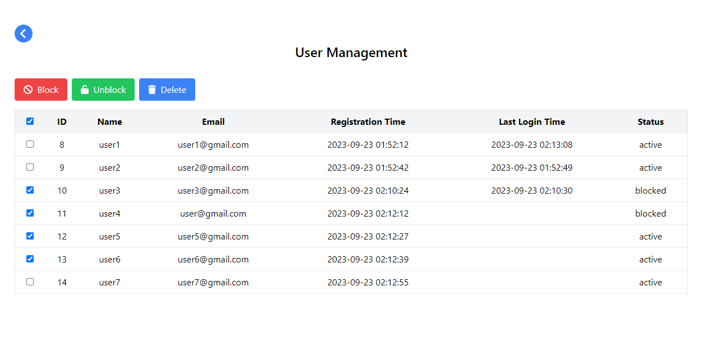

# User Management Web Application

Welcome to the User Management Web Application! This application is designed to provide user registration and authentication capabilities with advanced user management features.

## Features

- **Registration and Authentication**: Users can register with any email and authenticate using their credentials.
- **Role-Based Access**: Non-authenticated users are restricted from accessing the management panel, ensuring data security.
- **User Management Table**: Authenticated users gain access to the user management table, displaying user information: id, name, e-mail, last login time, registration time, and status (active/blocked).
- **Multi-Selection**: Users can select multiple rows using checkboxes.
- **Toolbar Actions**: The toolbar above the table offers actions like Block, Unblock, and Delete. Users can perform these actions on themselves or other users.
- **Blocking and Deletion**: Blocked users cannot log in, while deleted users can re-register.
- **User-Friendly Interface**: The interface is built with React and styled with Tailwind CSS, offering a modern and user-friendly experience.

## Technology Stack

- **Frontend**: React, Tailwind CSS
- **Backend**: Express.js, MySQL
- **Database ORM**: Sequelize

## How to Use

- Register a new user with any non-empty password.
- Authenticate using your credentials.
- Access the user management table with advanced features.
- Perform actions like blocking, unblocking, and deleting users as needed.

## License

This project is licensed under the [MIT License](LICENSE). Feel free to use, modify, and distribute the code for your purposes.

## Author

- GitHub: [YourGitHubUsername](https://github.com/YourGitHubUsername)

Thank you for using the User Management Web Application! Enjoy secure user management and data control.
